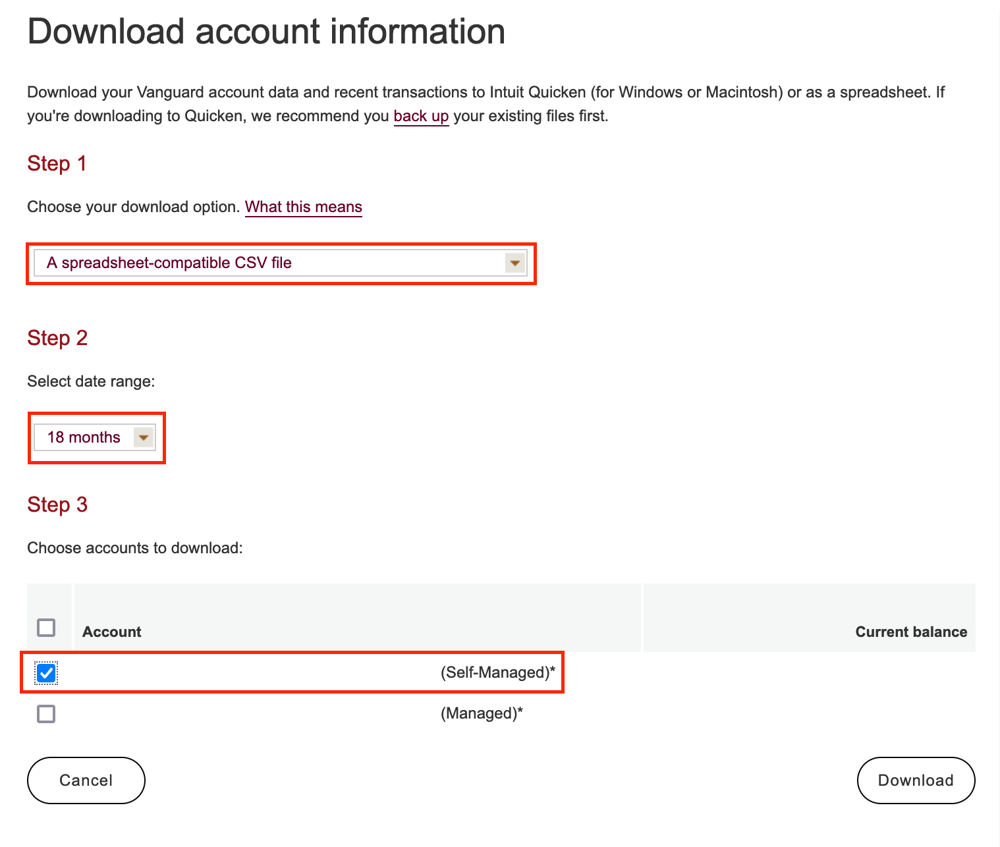
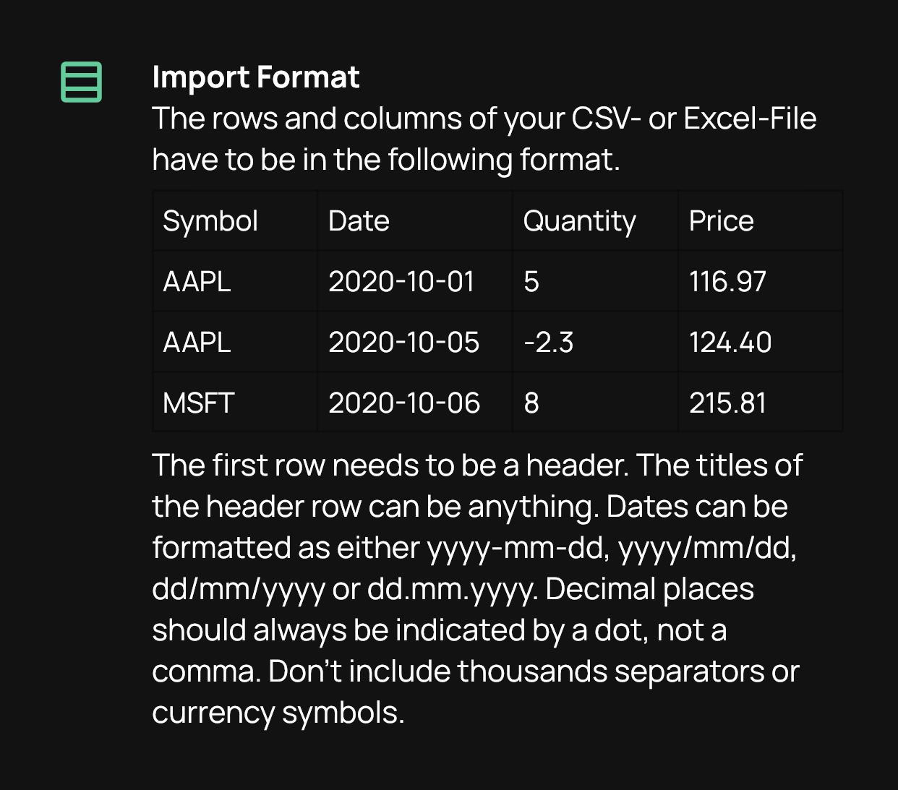

# Finna <!-- omit in toc -->

⚠️ **Small personal project! Contains UNTESTED code** ⚠️

- [Dependencies](#dependencies)
- [Getting Started](#getting-started)
- [API](#api)
  - [Logs](#logs)
  - [Stop](#stop)
- [Other Tasks](#other-tasks)
  - [Import Vanguard Transactions to Stock Events](#import-vanguard-transactions-to-stock-events)
  - [Download transaction history](#download-transaction-history)
  - [Run `format` task to fix up data](#run-format-task-to-fix-up-data)
  - [Send output file to iPhone](#send-output-file-to-iphone)


# Dependencies
All external dependencies can be installed via
```bash
task deps
```
- Note: Requires [task](https://taskfile.dev/#/installation) to run

# Getting Started
First, install project dependencies with
```bash
task deps
```

Next create environment files by running
```bash
task env
```

This will ask you for your Plaid Client ID and Secret. Once provided, it will generate a `.env` and `.env.docker` file to instruct your app to talk to Plaid Sandbox.

# API
If you want to run the web app:
```bash
task up
```
This will expose the app at http://localhost:8784 for the API
## Logs
Once services are running, view real-time logs with
```bash
task logs
```

## Stop
To stop the application
```bash
task stop
```

# Other Tasks
In addition to what you can do within the web application, you can also run some of the tasks manually on the command line.
## Import Vanguard Transactions to Stock Events
This task helps to format exported transactions from Vanguard in a way that can be imported into the Stock Events app.
## Download transaction history
Visit the Download Center in Vanguard

https://personal.vanguard.com/us/OfxWelcome



## Run `format` task to fix up data

```bash
➜ task format
task: [format] go run cmd/finna/main.go format -i input.csv -o output.csv
{"level":"info","msg":"Running finna","version":"latest"}
{"args":{"OutputFormat":"stock-events","InputFile":"input.csv","OutputFile":"output.csv"},"level":"info","msg":"Running format command"}
{"level":"info","msg":"Found 133 CSV rows"}
```

This task will filter out transactions that don't affect holdings, sort by date, and dump into a CSV format that is required by Stock Events.



Note that duplicate transactions will be ignored, so this operation should be safe to run as many times as necessary.

## Send output file to iPhone
Using iCloud, send the output file to your phone and import it from the Stock Events App.
